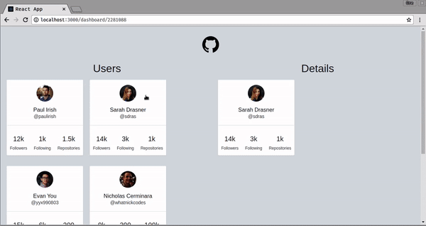

# Responsive Routing with React Router v4



## Getting Started
- Clone Repository

- Install the necessary modules
```
npm install
```

- Run application
```
npm start
```

- Navigate to browser ;)